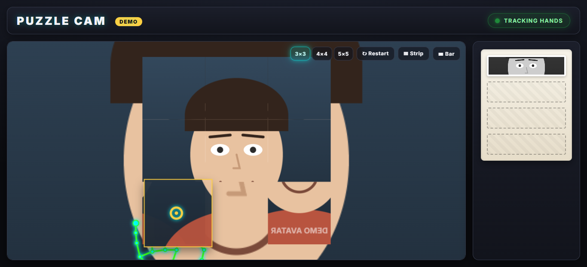
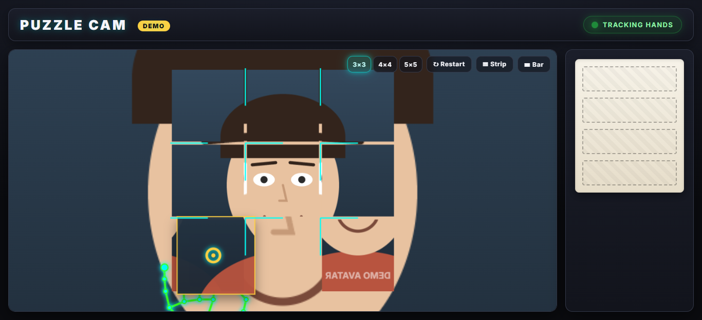
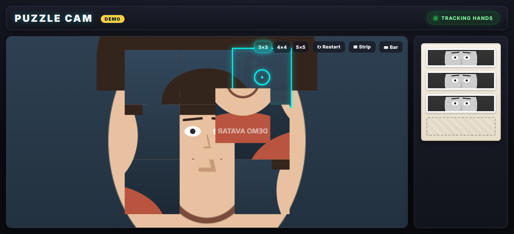

<div align="center">

# 🧩 Puzzle Cam

### Solve a puzzle of your own face — with your bare hands, in the air.

No mouse. No keyboard. No touchscreen. Just **wave your hands at your webcam**, let it snap a photo of you, and piece your shattered selfie back together by pinching tiles out of thin air. Every solved photo drops into a little black-and-white photo-booth strip you can keep.



<sub>☝️ That's the built-in **demo mode** playing itself with a synthetic avatar — your real face never has to appear in a recording.</sub>


</div>

---

## ✨ What is this?

Puzzle Cam is a tiny, dependency-free web toy inspired by a hand-tracking reel doing the rounds online. It uses **MediaPipe Hands** to follow your hands through the webcam, then turns gestures into the *only* input device:

> **Show both hands → it counts you down → snaps your photo → shatters it into a sliding puzzle → you pinch and drag the tiles back into place → the finished photo joins a photo-booth strip.**

It's all **vanilla HTML, CSS and JavaScript** — open it on any static server and it just runs. No frameworks, no bundler, no `npm install`.

---

## 🎬 See it in action

| Picking up a tile | Filling the photo strip |
| :---: | :---: |
|  |  |

- The **green skeleton** is your tracked hand.
- The **cursor ring** shows exactly where you're aiming — it turns **gold when you pinch** (grab).
- The **strip on the right** fills with one B&W photo per puzzle you solve.

---

## 🎮 How to play

1. **Allow the camera** when your browser asks.
2. **Hold both hands up** in view → a countdown starts (3… 2… 1…).
3. It **captures your face** with a flash and shatters it into a grid.
4. **Pinch** (touch your thumb and index finger together) over a tile to grab it.
5. **Move your hand** to drag the tile — release the pinch to drop it. It **snaps to the nearest cell and swaps**.
6. Rebuild your face. 🎉 Confetti, a B&W photo, and onto the next one.
7. Fill the strip, then **Download** it or **Reset** to keep going.

<details>
<summary><b>🤲 Gesture cheat-sheet</b></summary>

| Gesture | What it does |
| --- | --- |
| ✋✋ Both hands visible | Start a round (held briefly so it's not accidental) |
| 🤏 Pinch (thumb + index) | Grab the tile under your cursor |
| ✊➡️ Move while pinched | Drag the grabbed tile |
| 🖐️ Open your hand | Drop the tile — it snaps to the nearest cell and swaps |

</details>

---

## 🕹️ On-screen controls

Floating in the top-right of the play area:

- **3×3 / 4×4 / 5×5** — change the difficulty (how many tiles your face splits into).
- **↻ Restart** — start over from any point.
- **▦ Strip** — hide/show the photo-strip panel (the stage grows to fill the space).
- **▤ Bar** — hide/show the top bar for a cleaner, full-bleed view.

---

## 🎥 Showcase / Demo mode (record without your face)

Want to show this off without putting your own face on camera? Open **`simulation.html`** instead of `index.html`.

It runs a self-playing demo: a **synthetic avatar face** streams into the video, and an autopilot feeds **fake hand movements through the real gesture pipeline** — so it genuinely plays and auto-solves the puzzle on a loop, fills the strip, and restarts. Just hit record. 🎬

No webcam permission, no real face, no MediaPipe download required for the input — everything you see is the actual app reacting to synthetic hands.

---

## 🚀 Run it locally

Because webcams need a [secure context](https://developer.mozilla.org/en-US/docs/Web/Security/Secure_Contexts), you must serve the files over `http://localhost` (not by double-clicking the HTML file).

```bash
git clone https://github.com/LakshyaBadjatya/Puzzel3D.git
cd Puzzel3D

# Option A — VS Code: right-click index.html → "Open with Live Server"

# Option B — Python (any version):
python serve_nocache.py 5500        # no-cache dev server (handy while editing)
#   …or the stdlib one-liner:
python -m http.server 5500
```

Then open:

- 🎮 **Play:** <http://localhost:5500/index.html>
- 🎬 **Demo:** <http://localhost:5500/simulation.html>

> `localhost` counts as a secure context, so the camera works over plain `http` — no HTTPS setup needed for local dev.

---

## 🧠 How it works

A quick tour for the curious:

- **One render loop.** A single `requestAnimationFrame` loop in `app.js` reads the latest hand data, advances the state machine, and draws each layer.
- **A guarded state machine.** `state.js` owns the only mutable phase (`LOADING → IDLE → READY → COUNTDOWN → CAPTURE → PUZZLE → SOLVED → STRIP_ADD → …`) and rejects illegal transitions.
- **Gestures, mapped carefully.** The webcam preview is *mirrored* (selfie view) and uses `object-fit: cover`, so the hand landmarks are run through one shared `toStage()` transform (un-mirror + cover-crop). That's why the cursor and the skeleton land exactly on your real hand.
- **The puzzle.** `puzzle.js` slices the captured photo into an N×N grid, scrambles it solvably, and handles grab → drag (lerp-follow) → release (snap to nearest cell + swap).
- **The strip.** `photostrip.js` converts each solved photo to black-and-white and composites a downloadable PNG strip.

<details>
<summary><b>📁 Project structure</b></summary>

```
index.html        → the game
simulation.html   → self-playing demo (avatar + autopilot)
styles.css        → all styling + every animation keyframe
config.js         → tunables + UI strings
state.js          → state machine + shared app state
camera.js         → MediaPipe Hands + webcam setup
gestures.js       → landmarks → pinch / join / cursor (+ skeleton)
puzzle.js         → tile model, scramble, drag/swap/snap, render
photostrip.js     → B&W conversion + photo-strip PNG export
animations.js     → canvas tweens (countdown, confetti, fly-to-strip…)
app.js            → boot, the single rAF loop, wiring
simulation.js     → synthetic avatar + autopilot
serve_nocache.py  → tiny no-cache static dev server
BRIEF.md          → the original build brief (every animation listed)
CONTRACT.md       → the architecture contract the modules follow
```

</details>

---

## 🛠️ Tech stack

- **Vanilla JavaScript** (no framework, no build step)
- **[MediaPipe Hands](https://developers.google.com/mediapipe)** for real-time hand tracking (loaded from CDN)
- **HTML5 Canvas** for the video composite, puzzle board, and strip export
- A sprinkle of CSS `@keyframes` for the UI animations

---

## 🙌 Credits

- Concept inspired by a hand-tracking puzzle reel on Instagram.

---

<div align="center">
<sub>Made for fun. Wave at your webcam and enjoy. 👋</sub>
</div>
